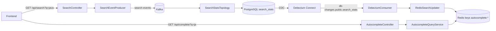

# Autocomplete System

Production‑grade event‑driven autocomplete system built with Kafka Streams, Debezium CDC, PostgreSQL, Redis, and Angular. It aggregates search queries in real time, projects CDC updates into Redis prefix indexes, and serves fast, ranked autocomplete suggestions.

## Contributing & Security

- Contribution guide: [`CONTRIBUTING.md`](CONTRIBUTING.md)
- Security policy: [`SECURITY.md`](SECURITY.md)

## Features

- Event-driven write side (`search-service`) with Kafka producer + Kafka Streams aggregation.
- CDC projection (`cdc-service`) from Debezium envelope (`payload.after`) into Redis sorted sets.
- Query side (`autocomplete-service`) with prefix-based suggestion lookup.
- Angular frontend (`frontend`) with API proxy for `/api/search` and `/api/complete`.
- Shared runtime contracts in `common` (`KafkaTopics`, `RedisKeys`, DTO/util classes).
- Unit + integration tests per backend service (`@Testcontainers(disabledWithoutDocker = true)`).

## Tech Stack

- Java 25 (Spring Boot 4.0.3)
- Apache Kafka + Kafka Streams (7.5.0)
- Debezium (PostgreSQL connector, 2.6)
- PostgreSQL 16
- Redis Stack
- Angular 17 + Nginx
- Node.js 20 (frontend)
- Docker Compose

## System Modules

- `search-service` (port `8082`): receives search requests, publishes `search-events`, aggregates frequencies, writes `search_stats`.
- `cdc-service` (port `8084`): listens to Debezium topics (`db-changes.public.search_stats`), updates Redis prefix keys.
- `autocomplete-service` (port `8081`): serves `/api/complete` from Redis sorted sets.
- `frontend` (port `4200`): UI + reverse proxy to backend APIs.
- `common`: shared constants and contracts used by Java services.
- Infra services in `docker-compose.yml`: `postgres`, `redis`, `kafka`, `zookeeper`, `debezium`, `kafka-ui`, bootstrap jobs.

## Architecture Flow



Core behavior:

- `SearchStatsTopology` trims and lowercases queries, aggregates into state store `search-counts-v2` (default; overridable via `SEARCH_STREAMS_STATE_STORE` / `search.streams.state-store`), persists to `search_stats`, emits `search-stats`.
- `DebeziumConsumer` parses envelope format and reads `payload.after`.
- `RedisSearchUpdater` writes one sorted-set entry per prefix (for `java`: `j`, `ja`, `jav`, `java`).
- For Debezium truncate events (`op=t`), `DebeziumConsumer` calls `RedisSearchUpdater.clearIndex()`; updates are blocked while clear is in progress to avoid stale-key races during rebuild.
- During TRUNCATE+rebuild windows (for example around `V4__normalize_search_stats_queries.sql`), autocomplete can be temporarily empty until CDC replays inserted rows.
- `AutocompleteQueryService` returns empty result for blank `q` or non-positive `limit`.

## Shared Runtime Identifiers

Use constants from `common` instead of hardcoding:

- `KafkaTopics.SEARCH_EVENTS` = `search-events`
- `KafkaTopics.SEARCH_STATS` = `search-stats`
- `KafkaTopics.DB_CHANGES_SEARCH_STATS` = `db-changes.public.search_stats`
- `KafkaTopics.DB_CHANGES_SEARCH_STATS_PATTERN` = `db-changes\.public\.search_stats`
- `RedisKeys.AUTOCOMPLETE_PREFIX` = `autocomplete:`

## Prerequisites

- **Docker Desktop (Compose plugin)** for running the full stack via `docker compose`.
- **(Optional) For local non-Docker app development:**
  - JDK 25 + Apache Maven
  - Node.js 20 + npm (for frontend)
  - Post-startup infra still runs in Docker (postgres, redis, kafka, debezium, etc.)

## Quick Start (Docker Compose)

Create local env file from template and update secrets:

```powershell
Copy-Item .env.example .env
```

`POSTGRES_USER`, `POSTGRES_PASSWORD`, `POSTGRES_DB` and strict connectivity vars (`SPRING_KAFKA_BOOTSTRAP_SERVERS`, `SPRING_DATA_REDIS_*`) are mandatory in `.env`; compose startup fails if any required value is missing.

Start full stack:

```powershell
docker compose up -d --build
```

Check containers:

```powershell
docker compose ps
```

UI and tools:

- Frontend: `http://localhost:4200`
- Kafka UI: `http://localhost:8080`
- Debezium Connect API: `http://localhost:8083/connectors`
- RedisInsight (from Redis Stack): `http://localhost:8001`

## API Endpoints

- `GET /api/search?q=<query>` via `search-service` (`8082`) or `frontend` (`4200`)
- `GET /api/complete?q=<prefix>&limit=<n>` via `autocomplete-service` (`8081`) or `frontend` (`4200`)

Examples:

```powershell
curl "http://localhost:4200/api/search?q=java"
curl "http://localhost:4200/api/complete?q=ja&limit=10"
```

## End-to-End Verification (CDC Path)

1) Trigger searches:

```powershell
curl "http://localhost:8082/api/search?q=java"
curl "http://localhost:8082/api/search?q=kotlin"
curl "http://localhost:8082/api/search?q=javascript"
```

2) Check autocomplete response:

```powershell
curl "http://localhost:8081/api/complete?q=ja&limit=10"
```

Expected: array contains `java` and/or `javascript` ordered by Redis ZSET score.

3) Verify PostgreSQL aggregate:

```powershell
docker compose exec postgres /bin/sh -lc 'psql -U "$POSTGRES_USER" -d "$POSTGRES_DB" -c "SELECT query, frequency FROM search_stats WHERE query IN ($$java$$,$$javascript$$) ORDER BY frequency DESC;"'
```

4) Verify Debezium connector:

```powershell
curl "http://localhost:8083/connectors"
curl "http://localhost:8083/connectors/postgres-connector/status"
```

5) Verify Redis prefix index:

```powershell
docker compose exec redis redis-cli ZREVRANGE autocomplete:ja 0 9 WITHSCORES
```

## Running Tests

Backend modules are independent Maven projects. Install `common` first when running outside Docker.

### Backend Tests

Install shared module:

```powershell
Set-Location .\common
mvn -B -DskipTests install
```

Run unit tests only (`*Test` via Surefire):

```powershell
Set-Location ..\search-service
mvn -B -ntp test

Set-Location ..\cdc-service
mvn -B -ntp test

Set-Location ..\autocomplete-service
mvn -B -ntp test
```

Run integration tests only (`*IT` via Failsafe; requires Docker, otherwise tests skip safely):

```powershell
Set-Location ..\search-service
mvn -B -ntp test-compile failsafe:integration-test failsafe:verify

Set-Location ..\cdc-service
mvn -B -ntp test-compile failsafe:integration-test failsafe:verify

Set-Location ..\autocomplete-service
mvn -B -ntp test-compile failsafe:integration-test failsafe:verify
```

Known backend test classes:

- `search-service`: `SearchControllerTest`, `SearchEventProducerTest`, `SearchStatsTopologyTest`, `SearchServiceKafkaIT`
- `cdc-service`: `DebeziumConsumerTest`, `CdcServiceRedisIT`
- `autocomplete-service`: `AutocompleteQueryServiceTest`, `AutocompleteServiceRedisIT`

### Frontend Tests

Install dependencies and run tests from `frontend/` directory:

```powershell
Set-Location .\frontend
npm ci

# Run tests in CI mode (headless, single run)
npm run test:ci

# Or run tests in watch mode (local development)
npm run test

# Build for production
npm run build
```

## CI Pipeline

GitHub Actions workflow: `.github/workflows/ci.yml` runs on every push to `main` and on pull requests.

### Job sequence

1. **common** — Builds shared module and caches it for downstream jobs.

2. **backend-unit** (matrix: autocomplete-service, search-service, cdc-service)
   - Runs `mvn test` for each backend service.
   - Uploads unit coverage reports (`jacoco.xml`) and test reports (`TEST-*.xml`).

3. **backend-integration** (matrix: autocomplete-service, search-service, cdc-service)
   - Requires Docker; tests skip gracefully if unavailable.
   - Runs `mvn test-compile failsafe:integration-test failsafe:verify` for each service.
   - Uploads integration coverage reports and test reports.

4. **frontend** 
   - Runs `npm ci`, lint (`npm run lint`), test (`npm run test:ci`), build (`npm run build`).
   - Uploads frontend coverage (`lcov.info`).

5. **sonarqube** (matrix: autocomplete-service, search-service, cdc-service)
   - Requires `SONAR_TOKEN` secret and appropriate `SONAR_HOST_URL` / `SONAR_ORGANIZATION` repository variables.
   - Skips gracefully if SonarCloud is used but `SONAR_ORGANIZATION` is missing.
   - Runs after backend-unit and backend-integration complete.

6. **sonarqube-frontend**
   - Frontend SonarQube analysis (similar conditions as backend sonarqube).
   - Runs after frontend job completes.

7. **docker**
   - Builds all Docker images: `autocomplete-service`, `search-service`, `cdc-service`, `frontend`.
   - Does not push; useful for validating builds on PRs.
   - Runs after backend-unit, backend-integration, and frontend complete.

8. **notify-telegram** (final stage)
   - Sends a Telegram notification with overall CI status.
   - Requires `TELEGRAM_TO` and `TELEGRAM_TOKEN` secrets; skips silently if unavailable.
   - Runs after all other jobs, regardless of their result.

### CI Secrets & Variables

**Secrets** (must be set in GitHub repo settings):
- `SONAR_TOKEN` (optional): enables SonarQube analysis.
- `TELEGRAM_TO` (optional): Telegram chat ID for notifications.
- `TELEGRAM_TOKEN` (optional): Telegram bot token for notifications.

**Repository Variables** (optional):
- `SONAR_HOST_URL` (default: `https://sonarcloud.io`): SonarQube server URL (for self-hosted Sonar).
- `SONAR_ORGANIZATION` (optional for self-hosted Sonar, **required for SonarCloud**): organization key.

### Notes

- If `SONAR_TOKEN` is missing, SonarQube jobs skip without failing the pipeline.
- If using SonarCloud and `SONAR_ORGANIZATION` is missing, backend/frontend Sonar analysis is skipped.
- Telegram notification is optional and skips if either token or chat ID is missing.
- All test reports and coverage are uploaded as artifacts (retention: 7 days).

## Docker Build

All services are containerized. Build images from the repo root using `docker-compose --build` or individual Dockerfile builds:

```powershell
# Build all services with compose
docker compose build

# Or build individual images
docker build -f search-service/Dockerfile -t search-service .
docker build -f cdc-service/Dockerfile -t cdc-service .
docker build -f autocomplete-service/Dockerfile -t autocomplete-service .
docker build -f frontend/Dockerfile -t frontend frontend
```

**Note:** Java services use the repo root as build context (they `COPY common/`); frontend uses its own directory context.

## Local Development (Without Docker for App Processes)

If you run services from IDE/terminal, keep infra in Docker and run apps locally.

1) Start infra only:

```powershell
docker compose up -d postgres redis zookeeper kafka kafka-init debezium debezium-init kafka-ui
```

2) Build/install shared module:

```powershell
Set-Location .\common
mvn -B -DskipTests install
```

3) Run Java services from each module root (`search-service`, `cdc-service`, `autocomplete-service`) and frontend from `frontend`.

Note: default app configs use Docker hostnames (`kafka`, `postgres`, `redis`), so for fully local process networking adjust `application.yml` values to `localhost` as needed.

## Configuration Notes

- Critical infra/runtime values are parameterized via `.env` in `docker-compose.yml` (DB credentials, connector settings, exposed ports).
- Published service ports are bound to `127.0.0.1` by default to reduce accidental exposure outside the host.
- In Compose, `search-service` datasource is derived from `POSTGRES_*`; use `SPRING_DATASOURCE_*` when running `search-service` outside Compose.
- Java services run with `SPRING_PROFILES_ACTIVE=strict` by default in Compose.
- `cdc-service` uses `AUTOCOMPLETE_CLEAR_INDEX_TIMEOUT` (default `PT5M` = 5 minutes) to bound the blocking clear operation during TRUNCATE+rebuild.
- Keep `frontend/proxy.conf.json` and `frontend/nginx.conf` aligned when API routes change.
- Schema changes should be mirrored in both:
  - `search-service/src/main/resources/db/migration/`
  - `infra/postgres/`
- Do not bypass CDC by writing from `search-service` directly to Redis.
- Keep lowercase normalization in write/index/query path.

## Security Baseline

- Keep secrets only in local `.env`; never commit `.env` or share it in tickets/chats.
- Use a long random `POSTGRES_PASSWORD` and rotate it when sharing environment access.
- When sharing logs, review/redact lines that may include connection details or credentials.

## Strict Mode

- Compose enables strict mode (`SPRING_PROFILES_ACTIVE=strict`) for `search-service`, `cdc-service`, and `autocomplete-service` by default.
- In strict mode, app startup fails fast if required variables are missing:
  - `search-service`: `SPRING_DATASOURCE_URL`, `SPRING_DATASOURCE_USERNAME`, `SPRING_DATASOURCE_PASSWORD`, `SPRING_KAFKA_BOOTSTRAP_SERVERS`
  - `cdc-service`: `SPRING_KAFKA_BOOTSTRAP_SERVERS`, `SPRING_DATA_REDIS_HOST`, `SPRING_DATA_REDIS_PORT`
  - `autocomplete-service`: `SPRING_DATA_REDIS_HOST`, `SPRING_DATA_REDIS_PORT`
- Management endpoint exposure for `search-service` is reduced to `health,info` by default via `SEARCH_MANAGEMENT_ENDPOINTS_EXPOSURE`.
- To run without strict profile for local debugging only, set `SPRING_PROFILES_ACTIVE=default` in `.env`.

## Useful Commands

Service logs:

```powershell
docker compose logs --tail=100 search-service
docker compose logs --tail=100 cdc-service
docker compose logs --tail=100 autocomplete-service
docker compose logs --tail=100 debezium
docker compose logs --tail=100 frontend
```

Inspect Kafka topics:

```powershell
docker compose exec kafka kafka-topics --bootstrap-server kafka:9092 --list
```

## Troubleshooting

### Empty autocomplete results

- Confirm searches were sent: call `/api/search` first.
- Check `search_stats` has rows in PostgreSQL:
  ```powershell
  docker compose exec postgres psql -U $POSTGRES_USER -d $POSTGRES_DB -c "SELECT COUNT(*) FROM search_stats;"
  ```
- Check Debezium connector status is `RUNNING`:
  ```powershell
  curl http://localhost:8083/connectors/postgres-connector/status
  ```
- Check Redis key exists (`autocomplete:<prefix>`):
  ```powershell
  docker compose exec redis redis-cli ZCARD autocomplete:ja
  ```
- Verify query normalization (`java` vs `Java`) and prefix used in `/api/complete`.

### Debezium connector is missing or failed

- `debezium-init` registers connector on startup; verify it ran successfully:
  ```powershell
  docker compose logs --tail=200 debezium-init
  ```
- Check connector logs in Debezium Connect:
  ```powershell
  curl http://localhost:8083/connectors/postgres-connector/tasks
  ```

### Integration tests are skipped

- Tests use `@Testcontainers(disabledWithoutDocker = true)`.
- If Docker is unavailable, skips are expected and harmless.
- Enable debug logging: `mvn -B -X test`

### Clear index times out during TRUNCATE+rebuild

- Default timeout is 5 minutes (`AUTOCOMPLETE_CLEAR_INDEX_TIMEOUT=PT5M`).
- Check cdc-service logs: `docker compose logs --tail=100 cdc-service`
- If table is very large, increase the timeout in `.env` before `docker compose up`.

### Frontend not loading or showing blank page

- Check frontend build: `docker compose logs --tail=50 frontend`
- Verify nginx config: `docker compose exec frontend cat /etc/nginx/conf.d/default.conf`
- Check browser console for API errors; ensure `/api/search` and `/api/complete` proxies are working.
- Try direct backend calls: `curl http://localhost:8081/api/complete?q=ja&limit=5`

## Best Practices (Development)

### Before Committing

1. Run backend unit tests: `mvn -B test` from each service directory.
2. Run frontend tests: `npm run test:ci` from `frontend/`.
3. Verify build: `docker compose build` (or individual `docker build` commands).
4. Check code formatting via SonarQube locally if possible, or rely on CI feedback.

### Operational Checklist

- **Schema changes:** Mirror Flyway migrations between `search-service/src/main/resources/db/migration/` and `infra/postgres/` before merging.
- **API route changes:** Keep `frontend/proxy.conf.json` and `frontend/nginx.conf` in sync.
- **Kafka/Redis identifiers:** Add new topics/keys to `common/src/main/java/lt/satsyuk/common/` first, then reference via `KafkaTopics` and `RedisKeys` constants.
- **Lowercase normalization:** Preserve in `SearchStatsTopology`, `DebeziumConsumer`, `RedisSearchUpdater`, and `AutocompleteQueryService`.
- **Debezium envelope:** Always parse `payload.after` when reading CDC events; assume envelope format.

### Local Debugging

- Use IDE run configurations for individual services instead of Docker for faster reload.
- Keep infra (`postgres`, `redis`, `kafka`, `debezium`) running in Compose; only run app processes locally.
- Adjust `application.yml` hostnames to `localhost` when running apps outside Docker.
- Check logs in real-time: `docker compose logs -f <service>`.

## Project Structure

- `docker-compose.yml`: full local stack.
- `common/`: shared constants and contracts.
- `search-service/`: command side + Kafka Streams aggregation.
- `cdc-service/`: Debezium topic consumer + Redis indexing.
- `autocomplete-service/`: Redis-backed suggestion API.
- `frontend/`: Angular UI and API proxy.
- `infra/`: Kafka topic init, Debezium connector config, PostgreSQL bootstrap SQL.

## Stop and Cleanup

Stop services:

```powershell
docker compose down
```

Stop and remove volumes:

```powershell
docker compose down -v
```
