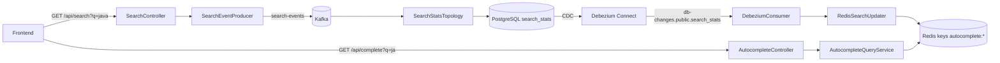

# Autocomplete System

Event-driven autocomplete pipeline with Kafka, Kafka Streams, Debezium CDC, PostgreSQL, Redis, and Angular UI.

The system records searches, aggregates query frequency in PostgreSQL, projects DB changes into Redis prefix indexes, and serves fast autocomplete suggestions.

## Features

- Event-driven write side (`search-service`) with Kafka producer + Kafka Streams aggregation.
- CDC projection (`cdc-service`) from Debezium envelope (`payload.after`) into Redis sorted sets.
- Query side (`autocomplete-service`) with prefix-based suggestion lookup.
- Angular frontend (`frontend`) with API proxy for `/api/search` and `/api/complete`.
- Shared runtime contracts in `common` (`KafkaTopics`, `RedisKeys`, DTO/util classes).
- Unit + integration tests per backend service (`@Testcontainers(disabledWithoutDocker = true)`).

## Tech Stack

- Java (Spring Boot)
- Apache Kafka + Kafka Streams
- Debezium (PostgreSQL connector)
- PostgreSQL 16
- Redis Stack
- Angular 17 + Nginx
- Docker Compose

## System Modules

- `search-service` (port `8082`): receives search requests, publishes `search-events`, aggregates frequencies, writes `search_stats`.
- `cdc-service` (port `8084`): listens to Debezium topics (`db-changes.public.search_stats`), updates Redis prefix keys.
- `autocomplete-service` (port `8081`): serves `/api/complete` from Redis sorted sets.
- `frontend` (port `4200`): UI + reverse proxy to backend APIs.
- `common`: shared constants and contracts used by Java services.
- Infra services in `docker-compose.yml`: `postgres`, `redis`, `kafka`, `zookeeper`, `debezium`, `kafka-ui`, bootstrap jobs.

## Architecture Flow



Core behavior:

- `SearchStatsTopology` lowercases queries, aggregates into state store `search-counts`, persists to `search_stats`, emits `search-stats`.
- `DebeziumConsumer` parses envelope format and reads `payload.after`.
- `RedisSearchUpdater` writes one sorted-set entry per prefix (for `java`: `j`, `ja`, `jav`, `java`).
- `AutocompleteQueryService` returns empty result for blank `q` or non-positive `limit`.

## Shared Runtime Identifiers

Use constants from `common` instead of hardcoding:

- `KafkaTopics.SEARCH_EVENTS` = `search-events`
- `KafkaTopics.SEARCH_STATS` = `search-stats`
- `KafkaTopics.DB_CHANGES_SEARCH_STATS` = `db-changes.public.search_stats`
- `KafkaTopics.DB_CHANGES_SEARCH_STATS_PATTERN` = `db-changes\.public\.search_stats`
- `RedisKeys.AUTOCOMPLETE_PREFIX` = `autocomplete:`

## Prerequisites

- Docker Desktop (Compose plugin)
- (Optional, for local non-Docker runs) JDK + Maven, Node.js + npm

## Quick Start (Docker Compose)

Create local env file from template and update secrets:

```powershell
Copy-Item .env.example .env
```

`POSTGRES_USER`, `POSTGRES_PASSWORD`, `POSTGRES_DB` and strict connectivity vars (`SPRING_KAFKA_BOOTSTRAP_SERVERS`, `SPRING_DATA_REDIS_*`) are mandatory in `.env`; compose startup fails if any required value is missing.

Start full stack:

```powershell
docker compose up -d --build
```

Check containers:

```powershell
docker compose ps
```

UI and tools:

- Frontend: `http://localhost:4200`
- Kafka UI: `http://localhost:8080`
- Debezium Connect API: `http://localhost:8083/connectors`
- RedisInsight (from Redis Stack): `http://localhost:8001`

## API Endpoints

- `GET /api/search?q=<query>` via `search-service` (`8082`) or `frontend` (`4200`)
- `GET /api/complete?q=<prefix>&limit=<n>` via `autocomplete-service` (`8081`) or `frontend` (`4200`)

Examples:

```powershell
curl "http://localhost:4200/api/search?q=java"
curl "http://localhost:4200/api/complete?q=ja&limit=10"
```

## End-to-End Verification (CDC Path)

1) Trigger searches:

```powershell
curl "http://localhost:8082/api/search?q=java"
curl "http://localhost:8082/api/search?q=kotlin"
curl "http://localhost:8082/api/search?q=javascript"
```

2) Check autocomplete response:

```powershell
curl "http://localhost:8081/api/complete?q=ja&limit=10"
```

Expected: array contains `java` and/or `javascript` ordered by Redis ZSET score.

3) Verify PostgreSQL aggregate:

```powershell
docker compose exec postgres psql -U autocomplete -d autocomplete -c "SELECT query, frequency FROM search_stats WHERE query IN ('java','javascript') ORDER BY frequency DESC;"
```

4) Verify Debezium connector:

```powershell
curl "http://localhost:8083/connectors"
curl "http://localhost:8083/connectors/postgres-connector/status"
```

5) Verify Redis prefix index:

```powershell
docker compose exec redis redis-cli ZREVRANGE autocomplete:ja 0 9 WITHSCORES
```

## Running Tests

Backend modules are independent Maven projects. Install `common` first when running outside Docker.

Unit + integration tests (integration tests run with Docker, otherwise skip safely):

```powershell
Set-Location .\common
mvn -B -DskipTests install

Set-Location ..\search-service
mvn -B test

Set-Location ..\cdc-service
mvn -B test

Set-Location ..\autocomplete-service
mvn -B test
```

Known test classes:

- `search-service`: `SearchControllerTest`, `SearchEventProducerTest`, `SearchStatsTopologyTest`, `SearchServiceKafkaIntegrationTest`
- `cdc-service`: `DebeziumConsumerTest`, `CdcServiceRedisIntegrationTest`
- `autocomplete-service`: `AutocompleteQueryServiceTest`, `AutocompleteServiceRedisIntegrationTest`

## Local Development (Without Docker for App Processes)

If you run services from IDE/terminal, keep infra in Docker and run apps locally.

1) Start infra only:

```powershell
docker compose up -d postgres redis zookeeper kafka kafka-init debezium debezium-init kafka-ui
```

2) Build/install shared module:

```powershell
Set-Location .\common
mvn -B -DskipTests install
```

3) Run Java services from each module root (`search-service`, `cdc-service`, `autocomplete-service`) and frontend from `frontend`.

Note: default app configs use Docker hostnames (`kafka`, `postgres`, `redis`), so for fully local process networking adjust `application.yml` values to `localhost` as needed.

## Configuration Notes

- Critical infra/runtime values are parameterized via `.env` in `docker-compose.yml` (DB credentials, connector settings, exposed ports).
- Published service ports are bound to `127.0.0.1` by default to reduce accidental exposure outside the host.
- In Compose, `search-service` datasource defaults are derived from `POSTGRES_*` (with optional `SPRING_DATASOURCE_*` overrides).
- Java services run with `SPRING_PROFILES_ACTIVE=strict` by default in Compose.
- Keep `frontend/proxy.conf.json` and `frontend/nginx.conf` aligned when API routes change.
- Schema changes should be mirrored in both:
  - `search-service/src/main/resources/db/migration/`
  - `infra/postgres/`
- Do not bypass CDC by writing from `search-service` directly to Redis.
- Keep lowercase normalization in write/index/query path.

## Security Baseline

- Keep secrets only in local `.env`; never commit `.env` or share it in tickets/chats.
- Use a long random `POSTGRES_PASSWORD` and rotate it when sharing environment access.
- When sharing logs, review/redact lines that may include connection details or credentials.

## Strict Mode

- Compose enables strict mode for `search-service`, `cdc-service`, and `autocomplete-service` by default.
- In strict mode, app startup fails fast if required variables are missing (`SPRING_DATASOURCE_*` for non-Compose runs, `SPRING_KAFKA_*`, `SPRING_DATA_REDIS_*`).
- Management endpoint exposure for `search-service` is reduced to `health,info` by default via `SEARCH_MANAGEMENT_ENDPOINTS_EXPOSURE`.
- To run without strict profile for local debugging only, set `SPRING_PROFILES_ACTIVE=default` in `.env`.

## Useful Commands

Service logs:

```powershell
docker compose logs --tail=100 search-service
docker compose logs --tail=100 cdc-service
docker compose logs --tail=100 autocomplete-service
docker compose logs --tail=100 debezium
docker compose logs --tail=100 frontend
```

Inspect Kafka topics:

```powershell
docker compose exec kafka kafka-topics --bootstrap-server kafka:9092 --list
```

## Troubleshooting

### Empty autocomplete results

- Confirm searches were sent: call `/api/search` first.
- Check `search_stats` has rows in PostgreSQL.
- Check Debezium connector status is `RUNNING`.
- Check Redis key exists (`autocomplete:<prefix>`).
- Verify query normalization (`java` vs `Java`) and prefix used in `/api/complete`.

### Debezium connector is missing

- `debezium-init` registers connector on startup.
- Check init logs:

```powershell
docker compose logs --tail=200 debezium-init
```

### Integration tests are skipped

- Tests use `@Testcontainers(disabledWithoutDocker = true)`.
- If Docker is unavailable, skips are expected.

## Project Structure

- `docker-compose.yml`: full local stack.
- `common/`: shared constants and contracts.
- `search-service/`: command side + Kafka Streams aggregation.
- `cdc-service/`: Debezium topic consumer + Redis indexing.
- `autocomplete-service/`: Redis-backed suggestion API.
- `frontend/`: Angular UI and API proxy.
- `infra/`: Kafka topic init, Debezium connector config, PostgreSQL bootstrap SQL.

## Stop and Cleanup

Stop services:

```powershell
docker compose down
```

Stop and remove volumes:

```powershell
docker compose down -v
```

