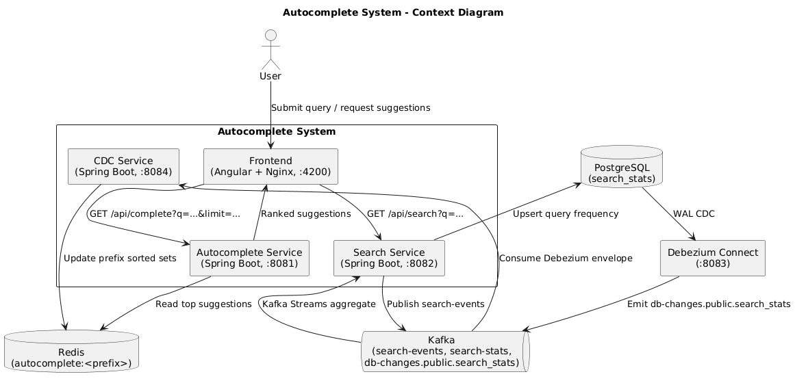
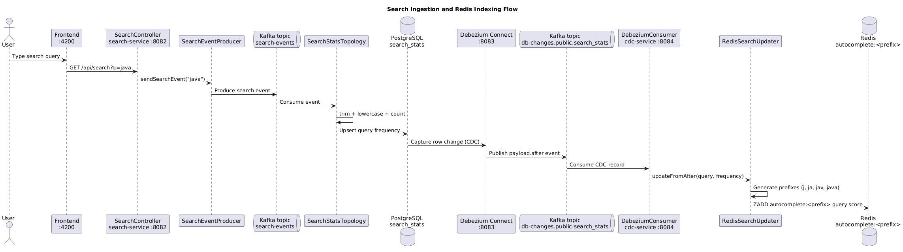
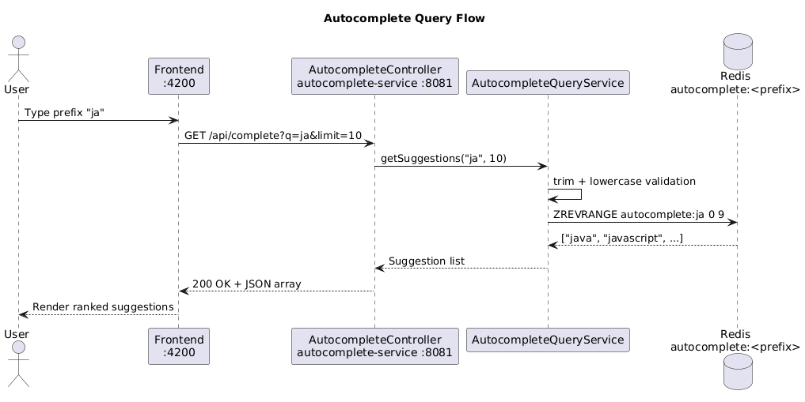

# Architecture

Diagrams are stored in `docs/diagrams/` as PlantUML source and exported PNG files.

## Context: Event-driven autocomplete pipeline

Source: `docs/diagrams/context-autocomplete-system.puml`

## Sequence: search ingestion and indexing

Source: `docs/diagrams/sequence-search-ingestion.puml`

## Sequence: autocomplete query flow

Source: `docs/diagrams/sequence-autocomplete-query.puml`
